# The Ultimate TODO List App

## Overview
This project was created as part of _CS3035: Building User Interfaces_ course (Fall 2022). The Ultimate To-Do List App allows users to manage their tasks, meetings, and shopping lists efficiently. Each category is further divided into subsections for better organization:
- **Tasks:** Today's Tasks, Upcoming Tasks, Starred Tasks, Deleted Tasks
- **Meetings:** Scheduled Meetings, Upcoming Meetings
- **Shopping List:** Items to Purchase

Users can perform CRUD (Create, Read, Update, Delete) operations on each of these objects.

---

## Requirements

### Different Views
I have implemented a variety of views to display and interact with different aspects of the project:
- **Splash Screen View:** The initial screen displayed when the application is launched.
- **To-Do List View:** Displays the main categories—Tasks, Meetings, and Shopping List.
- **Sub Views:** Each category has its own subviews:
  - Tasks: Today's Tasks, Upcoming Tasks, Starred Tasks, Deleted Tasks
  - Meetings: Scheduled Meetings, Upcoming Meetings
  - Shopping List: Item List
- **CRUD Action Prompts:**  
  Each CRUD operation opens a new window. For example, selecting "View Task" opens a secondary window displaying detailed information about that task.

### MVC Architecture
- **Model:** One model class for each domain object.
- **Views:** Three to four views for each domain object.
- **Controller:** One controller for each domain object to handle user interactions.
- **FXML:** I used FXML for designing the views and windows for a clean and maintainable UI.

---

## Custom Widgets
I created the following custom widgets for better functionality and modularity:
1. **TaskWidget:** Displays task details and actions.
2. **MeetingWidget:** Displays meeting details and actions.
3. **ShoppingItemWidget:** Displays shopping list items with actions.

---

## Domain Objects
The application allows users to create, edit, view, and delete the following domain objects:
1. **Tasks**
2. **Meetings**
3. **Shopping List Items**

---

## Challenges and Improvements

### Challenges
1. **Date Implementation:**  
   Handling dates in JavaFX was particularly challenging due to the diverse date formats and parsing methods required.
2. **Multiple Views:**  
   Designing and displaying different views for each section of the application required careful layout management.
3. **UI Alignment:**  
   Aligning sections properly and ensuring the UI remained responsive and user-friendly was difficult, especially with a variety of user interactions.

---

## Screenshots

1. **Splash Screen:**
     
  

2. **Tasks:**  
   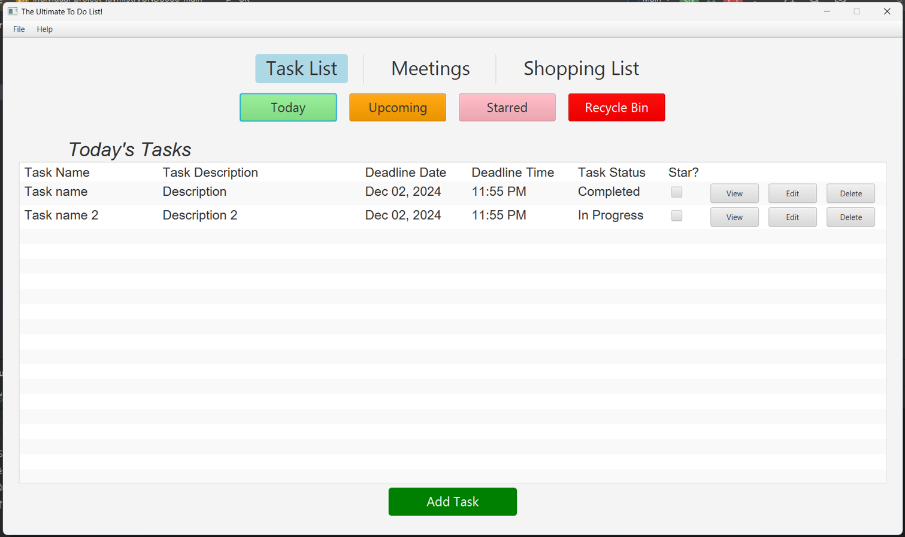
   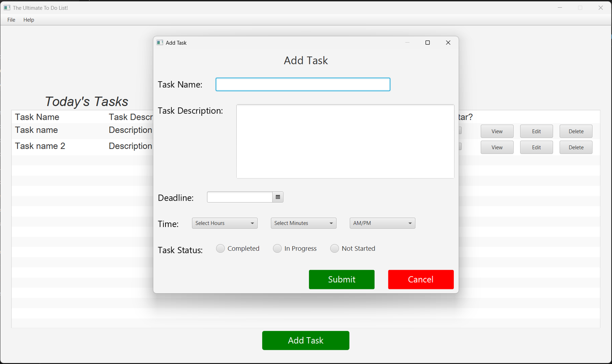
   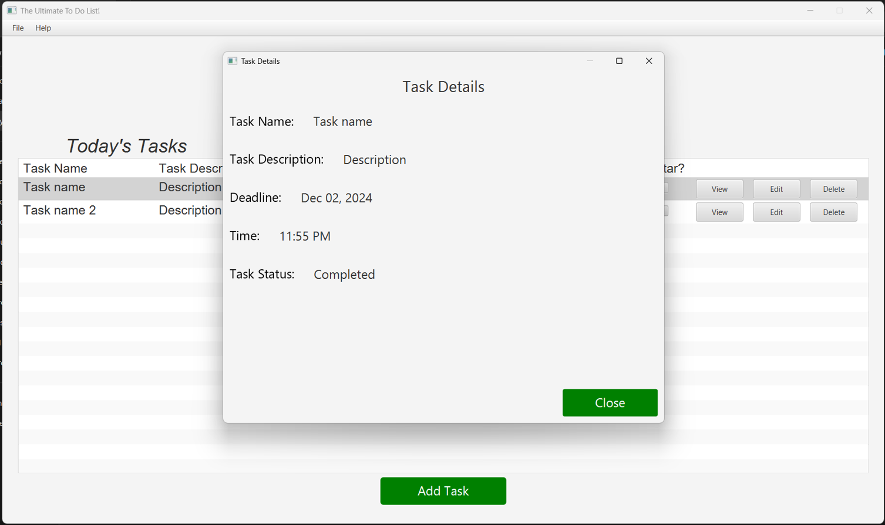
   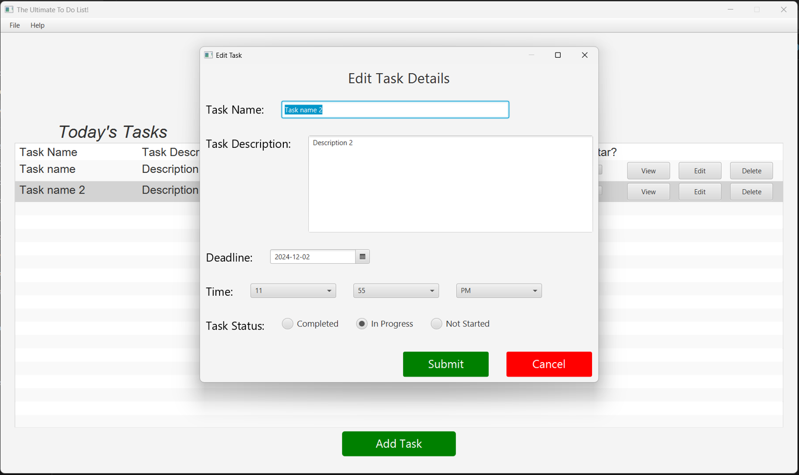
   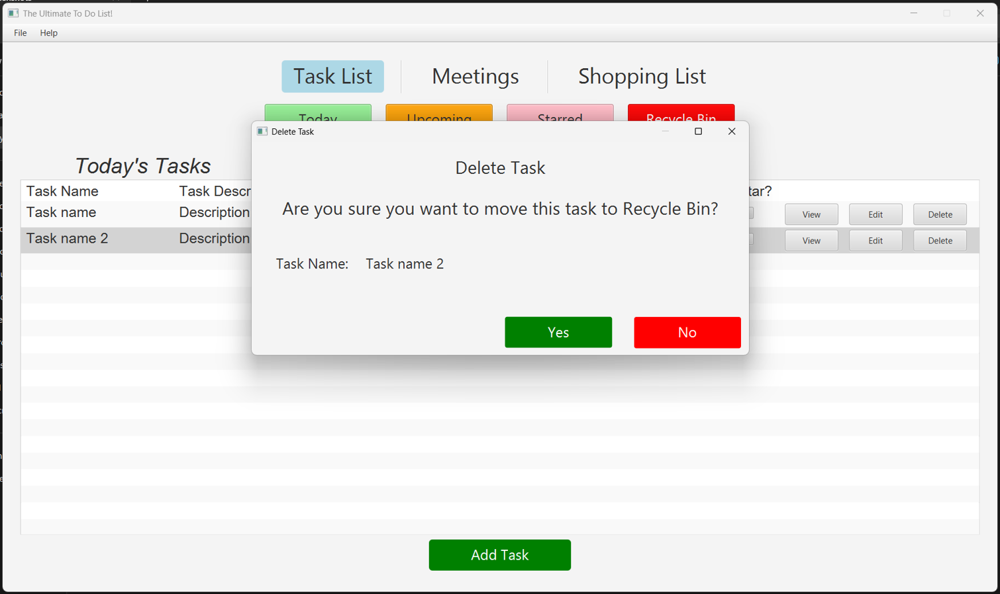
  

3. **Meetings:**  
   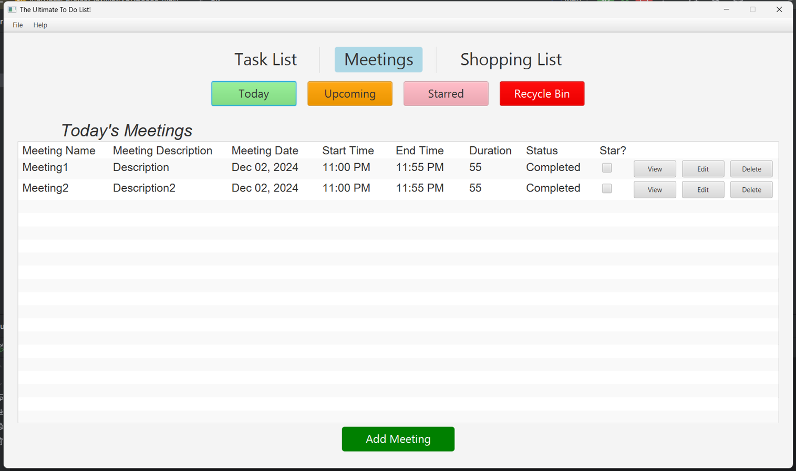
   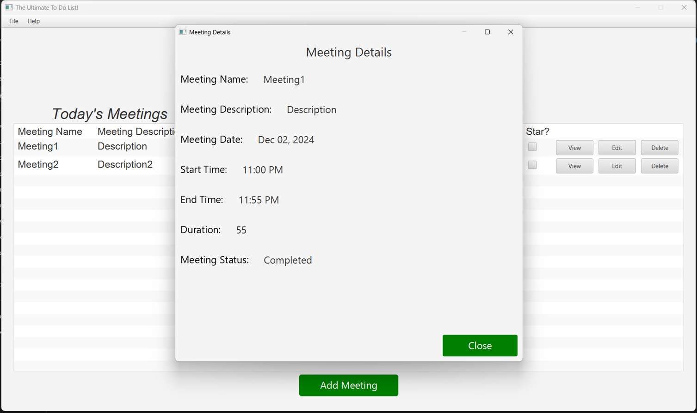
   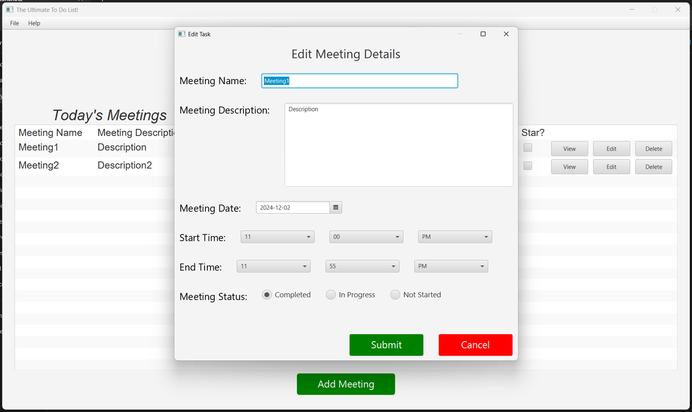
   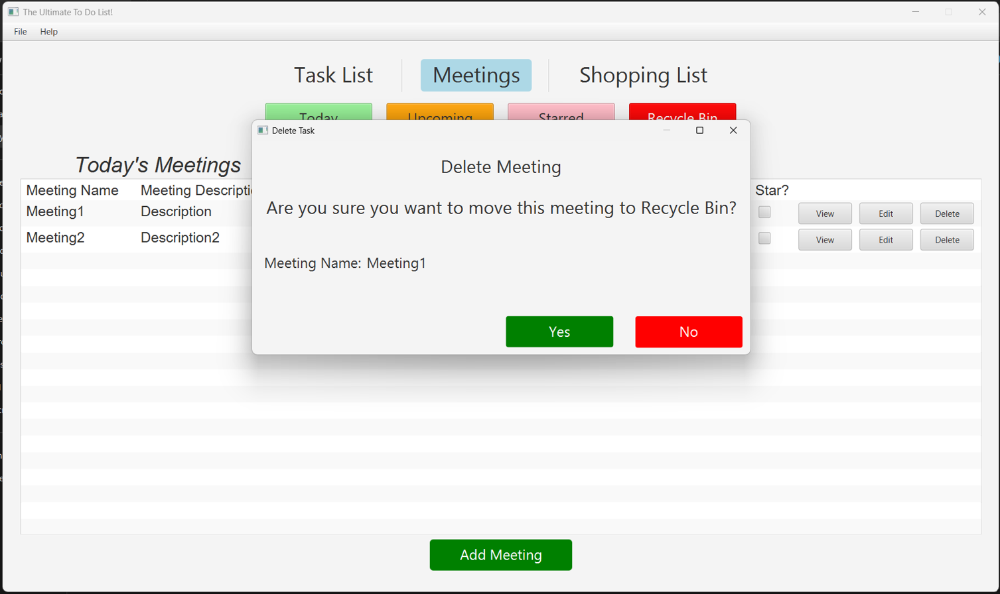  
  

4. **Shopping List:**  
   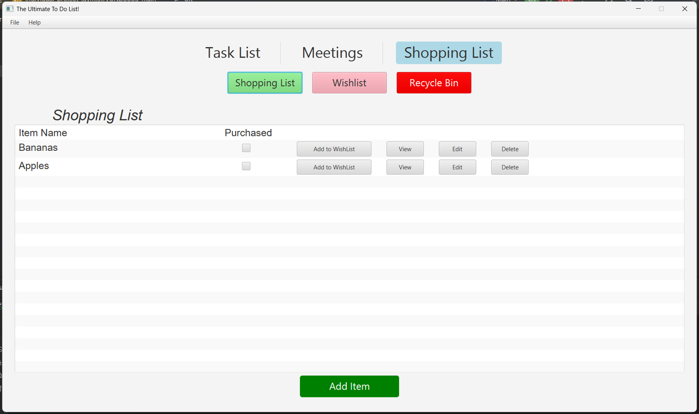
   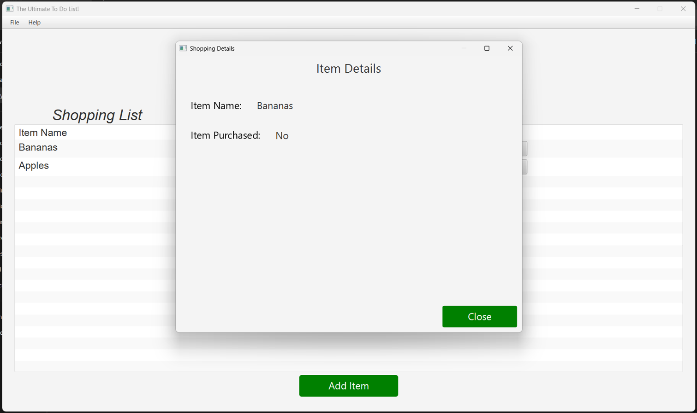
   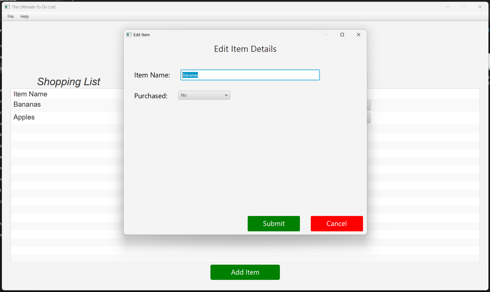
   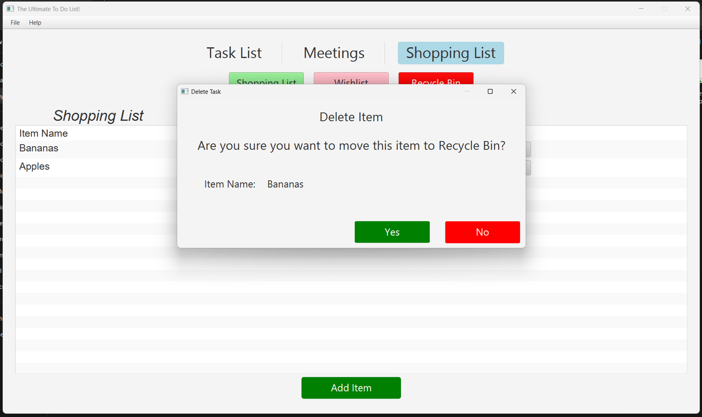